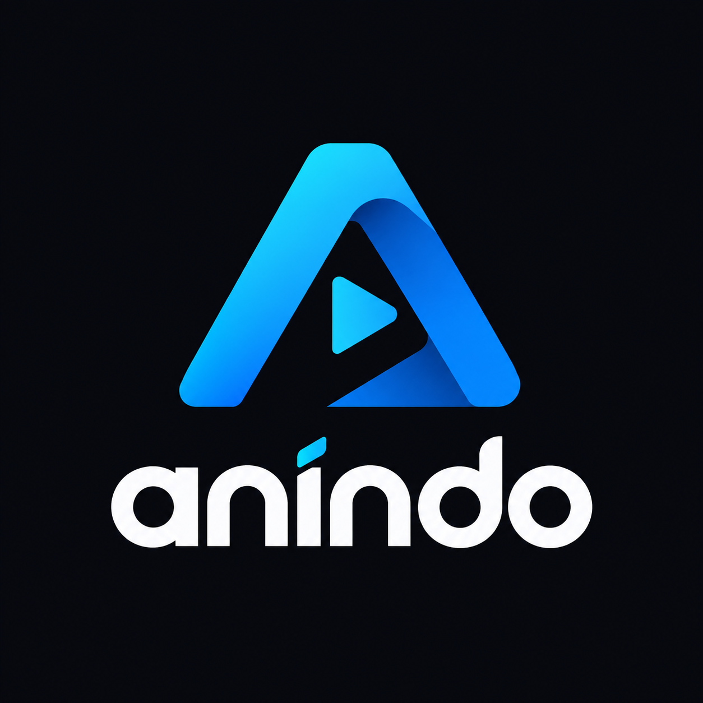

<p align="center">
  
</p>

<h1 align="center">anindo-app (Anime Indo Android)</h1>

<p align="center">
  <strong>Aplikasi Streaming & Unduh Anime Bebas Iklan untuk Android (Subtitle Indonesia), terinspirasi oleh filosofi dan desain Mihon / Tachiyomi.</strong>
</p>

<p align="center">
  <a href="https://github.com/Zirosaur/anindo-app/releases/latest">
    
  </a>
  <a href="https://github.com/Zirosaur/anindo-app/releases">
    
  </a>
  
</p>

---

## ✨ Fitur Utama

- 🚫 **100% Bebas Iklan (Zero Ads)**: Menonton anime dengan nyaman dan aman tanpa gangguan banner iklan, pop-up, atau pengalihan berbahaya.
- 🍔 **Burger Menu (Navigation Drawer) & Pengaturan Lengkap**:
  - **Menu Samping ☰**: Akses cepat dengan mengetuk tombol menu atau usap dari tepi kiri layar (*edge swipe*).
  - **Pengaturan Pemutar**: Kualitas default (Auto, 1080p, 720p, 480p, 360p), rasio aspek (Fit, Zoom, Stretch), kecepatan putar, durasi lompat ganda (5-30s), toggle gestur, keep-awake, dan auto-pause.
  - **Pengaturan Unduhan**: Opsi unduh hanya via Wi-Fi, pilihan lokasi folder publik atau internal, dan notifikasi unduhan selesai.
  - **Pengaturan Jaringan**: Pilihan DoH provider (Cloudflare 1.1.1.1 / Google 8.8.8.8 / Sistem) serta sinkronisasi aturan OTA langsung dari GitHub.
  - **Pengaturan Tampilan**: Tema Gelap, AMOLED Hitam Murni (hemat baterai), Terang, Mengikuti Sistem, dan Dynamic Color (Material You).
  - **Manajemen Data**: Cek dan bersihkan cache gambar poster Coil serta hapus riwayat tontonan.
- 🎨 **Antarmuka Modern (Mihon-Style UX & Material 3)**:
  - **Koleksi (Bookmarks)**: Tandai dan simpan anime favorit ke perpustakaan lokal.
  - **Ongoing Feed**: Episode anime terbaru yang sedang tayang diperbarui secara berkala setiap hari.
  - **Jelajah (Explore)**: Pencarian cepat dan serentak di berbagai penyedia (*concurrent multi-provider search*).
  - **Riwayat (History)**: Melacak progres menonton dengan indikator persentase dan waktu putar terakhir.
  - **Tab Unduhan**: Manajemen video offline yang tersimpan di perangkat.
- 🎬 **Pemutar Video Kaya Fitur (ExoPlayer Media3)**:
  - **Keep Screen Awake**: Layar tetap menyala selama video diputar tanpa redup atau mati otomatis.
  - **Auto-Pause Cerdas**: Pemutaran video dan audio otomatis terjeda saat aplikasi diminimalkan, layar dimatikan, atau tombol power ditekan.
  - **Kontrol Gestur**: Usap sisi kiri untuk kecerahan layar, usap sisi kanan untuk volume suara, dan ketuk ganda untuk melompat sesuai interval pilihan.
  - **Smart Resume**: Melanjutkan pemutaran secara otomatis di detik terakhir yang Anda tonton.
  - **Pengaturan Lengkap**: Pilihan rasio aspek (*Fit, Zoom, Stretch*), kecepatan putar (0.5x - 2.0x), dan tombol pengunci layar (*Lock Controls*).
- 📥 **Pengunduh Offline (Background Download Manager)**:
  - Mengunduh episode di latar belakang menggunakan **Android WorkManager**.
  - Mendukung berkas **Direct MP4** dan penggabungan segmen **HLS MPEG-TS (`.m3u8`)** otomatis menjadi video utuh.
  - Menyimpan langsung ke direktori publik `/sdcard/Download/Anindo/` sehingga dapat diputar dari galeri ponsel maupun pemutar video pihak ketiga (dengan fallback Scoped Storage aman).
  - Notifikasi progres unduhan langsung pada bilah notifikasi sistem Android.
- 🌐 **Anti-Blokir & Multi-Provider Scraper**:
  - **Built-in DNS-over-HTTPS (DoH)**: Menggunakan Cloudflare & Google DoH bawaan sehingga dapat memutar anime secara lancar tanpa perlu memasang VPN tambahan.
  - **Cross-Provider Failover**: Jika salah satu sumber mengalami kendala server, aplikasi dapat mencari sumber alternatif secara transparan.
  - **Dynamic Domain Resolver**: Otomatis mendeteksi domain mirror jika situs penyedia berganti alamat.

---

## 🏛️ Arsitektur Teknologi (Tech Stack)

| Komponen | Teknologi yang Digunakan |
|---|---|
| **Bahasa** | Kotlin 100% (Android Native) |
| **UI Framework** | Jetpack Compose + Material 3 Design System |
| **Arsitektur** | MVVM (Model-View-ViewModel) + Single Activity NavHost |
| **Media Player** | AndroidX Media3 (ExoPlayer Engine dengan HLS & OkHttp DataSource) |
| **Database Lokal** | Android Room Database (SQLite dengan KSP) |
| **Pemuatan Gambar** | Coil Compose (Memory & Disk Cache) |
| **Jaringan & Scraper** | OkHttp 4 + Jsoup HTML DOM Parser |
| **Tugas Latar Belakang** | Android WorkManager (Offline Downloader & Notifikasi) |
| **Build System** | Gradle Kotlin DSL (`build.gradle.kts`) + Version Catalog (`libs.versions.toml`) |

---

## 📦 Unduh & Pasang Berkas APK

Setiap rilis berkas APK resmi dapat diunduh langsung melalui tautan berikut:

👉 **[Unduh Versi Terbaru (GitHub Releases)](https://github.com/Zirosaur/anindo-app/releases/latest)**

> [!TIP]
> Aplikasi menggunakan penandatanganan rilis persisten (`anindo-release.jks`), sehingga setiap pembaruan versi baru dapat langsung ditimpa (*update in-place*) tanpa perlu menghapus instalasi versi sebelumnya.

---

## 🚀 Membangun dari Sumber (Build from Source)

### Prasyarat:
- JDK 17 atau yang lebih baru
- Android SDK (API 34)

### Langkah Kompilasi:
```bash
# Clone repositori
git clone https://github.com/Zirosaur/anindo-app.git
cd anindo-app

# Berikan izin eksekusi gradle wrapper
chmod +x gradlew

# Kompilasi berkas APK Release
./gradlew assembleRelease
```
Berkas APK hasil kompilasi akan berada di direktori:
`app/build/outputs/apk/release/app-release.apk`

---

## 🤝 Kontribusi & Lisensi

Proyek ini bersifat sumber terbuka (*open-source*) untuk komunitas anime Indonesia.  
Dikembangkan dengan ❤️ untuk menghadirkan pengalaman menonton anime yang bersih, cepat, dan nyaman di Android.
